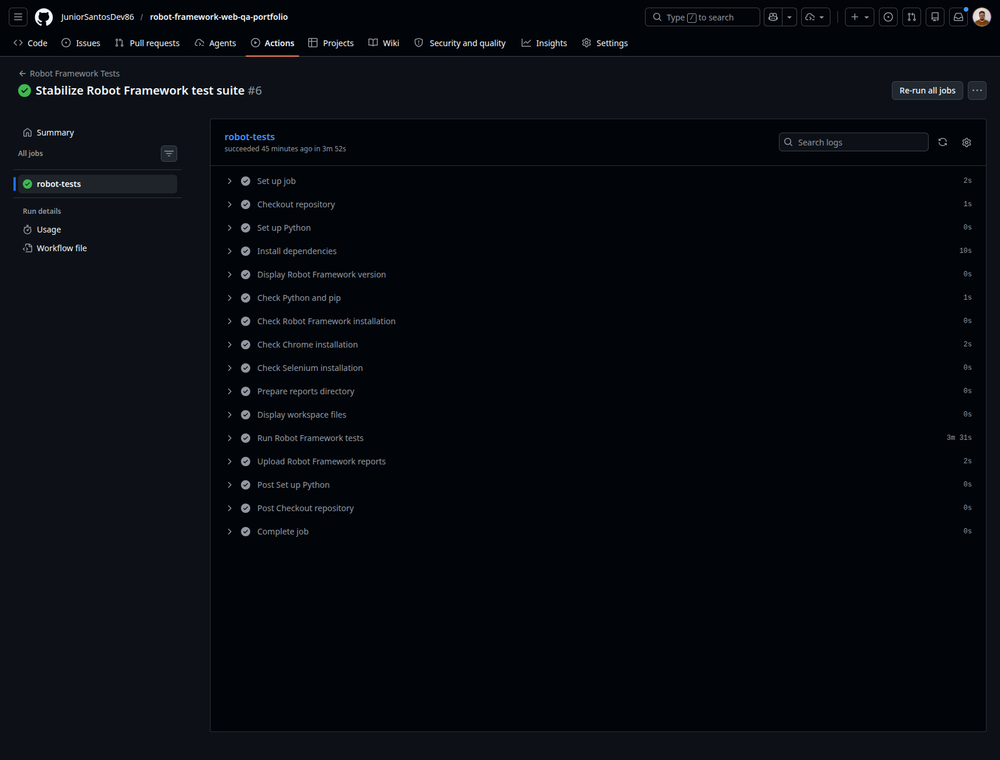
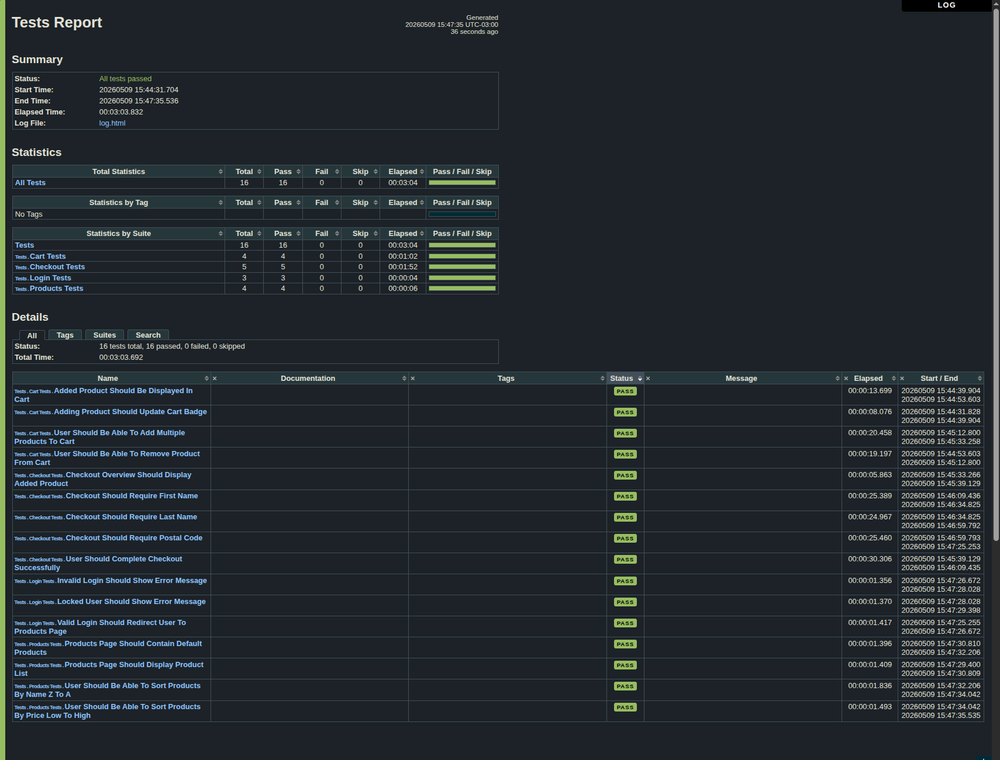

# Portfólio QA Web com Robot Framework

[](https://github.com/JuniorSantosDev86/robot-framework-web-qa-portfolio/actions/workflows/robot-tests.yml)


Projeto de portfólio QA focado em automação de testes web usando Robot Framework e SeleniumLibrary.

Este projeto contém uma suíte automatizada para a aplicação SauceDemo, cobrindo login, página de produtos, ordenação, carrinho e checkout. A estrutura foi mantida simples e modular para facilitar manutenção, leitura por recrutadores e execução em CI.

## Tecnologias Utilizadas

- Python 3.12
- Robot Framework
- SeleniumLibrary
- Selenium WebDriver
- Google Chrome headless
- GitHub Actions
- SauceDemo

## Escopo dos Testes

Aplicação testada:

https://www.saucedemo.com/

Cenários cobertos:

- Login com usuário válido.
- Login com usuário inválido.
- Login com usuário bloqueado.
- Exibição da página de produtos.
- Ordenação de produtos.
- Adição de produtos ao carrinho.
- Remoção de produtos do carrinho.
- Checkout com sucesso.
- Validações obrigatórias do formulário de checkout.

## Estrutura do Projeto

```text
.
├── .github/
│   └── workflows/
│       └── robot-tests.yml
├── README.md
├── requirements.txt
├── .gitignore
├── tests/
│   ├── login_tests.robot
│   ├── products_tests.robot
│   ├── cart_tests.robot
│   └── checkout_tests.robot
└── resources/
    ├── common.resource
    ├── ui_actions.resource
    ├── login_keywords.resource
    ├── products_keywords.resource
    ├── cart_keywords.resource
    └── checkout_keywords.resource
```

## Instalação das Dependências

Crie o ambiente virtual:

```bash
python3 -m venv .venv
```

Ative o ambiente virtual no Linux/macOS:

```bash
source .venv/bin/activate
```

Atualize o pip:

```bash
python -m pip install --upgrade pip
```

Instale as dependências:

```bash
pip install -r requirements.txt
```

## Execução dos Testes

Execute toda a suíte:

```bash
robot -d results tests
```

Ou execute uma suíte específica:

```bash
robot -d results tests/login_tests.robot
robot -d results tests/products_tests.robot
robot -d results tests/cart_tests.robot
robot -d results tests/checkout_tests.robot
```

## Relatórios Locais

Após a execução, o Robot Framework gera os relatórios em `results/`:

- `results/report.html`
- `results/log.html`
- `results/output.xml`

Abra `results/report.html` ou `results/log.html` no navegador para revisar os resultados.

## Integração Contínua

Os testes são executados automaticamente pelo GitHub Actions em eventos de `push` e `pull_request` na branch `main`. Também é possível executar manualmente pela aba Actions.

O workflow instala as dependências, executa a suíte Robot Framework e salva os relatórios como artifact com o nome `robot-framework-reports`.

## Cenários Implementados

- Login válido redireciona para a página de produtos.
- Login inválido exibe mensagem de erro.
- Usuário bloqueado exibe mensagem de erro.
- Página de produtos exibe a lista de itens.
- Página de produtos contém produtos esperados.
- Usuário consegue ordenar produtos por nome de Z a A.
- Usuário consegue ordenar produtos por preço do menor para o maior.
- Produto adicionado atualiza o badge do carrinho.
- Produto adicionado aparece no carrinho.
- Produto pode ser removido do carrinho.
- Múltiplos produtos podem ser adicionados ao carrinho.
- Resumo do checkout exibe produto adicionado.
- Usuário consegue finalizar uma compra com sucesso.
- Checkout exige primeiro nome.
- Checkout exige sobrenome.
- Checkout exige CEP.

## Estratégia de Testes

A suíte foi organizada para validar fluxos funcionais críticos da aplicação SauceDemo em uma jornada web end-to-end.

Os testes cobrem autenticação, listagem e ordenação de produtos, carrinho de compras e checkout. A estrutura separa cenários de teste e keywords reutilizáveis, facilitando leitura, manutenção e evolução do projeto.

A execução automatizada no GitHub Actions garante validação contínua da suíte e disponibiliza os relatórios HTML do Robot Framework como artifact.

A documentação completa da estratégia está disponível em:

[Ver estratégia de testes](docs/TEST_STRATEGY.md)

## Evidência de Execução no GitHub Actions



## Relatório Local do Robot Framework



## Estratégia de Testes

[Ver estratégia de testes](docs/TEST_STRATEGY.md)
